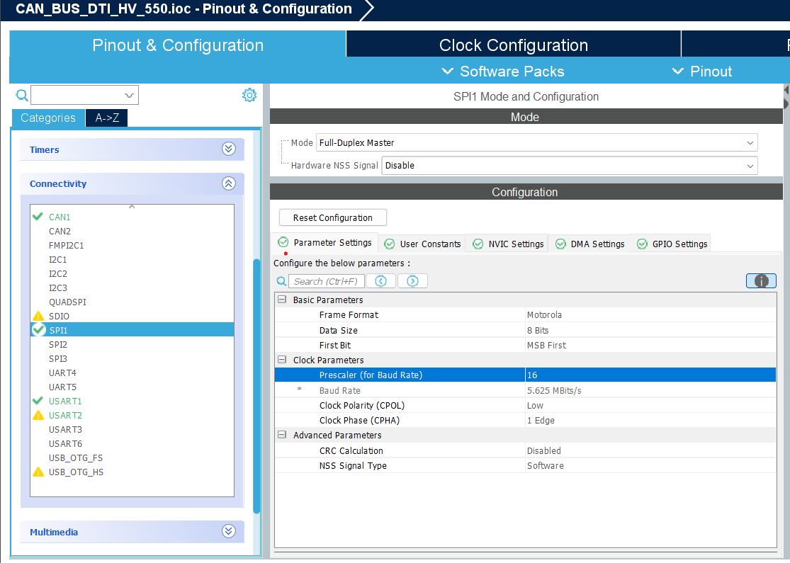

This project sets up CAN communication between a **DTI HV 550 Motor Controller** and an **STM32 Nucleo F446RE** board using an **MCP2515 CAN module**. The **DTI CAN Tool** is used for monitoring, debugging, and verifying communication on the CAN network.

# Hardware Requirements

| Component                           | Description                                                        |
|------------------------------------|--------------------------------------------------------------------|
| **DTI HV 550 Motor Controller**     | High-voltage EV motor controller with CAN interface                |
| **STM32 Nucleo F446RE**             | ARM Cortex-M4 development board                                    |
| **MCP2515 CAN Module**              | SPI-based CAN controller + transceiver                             |
| **DTI CAN Tool**                    | For set-up and tuning                                              |
| **Termination Resistors (2x 120Ω)** | Placed at each end of the CAN bus line                             |
| **Connecting Wires**                | For SPI and power connections between STM32, MCP2515 and DTI HV 550|
| **External Power Supply**           | For powering components.                                           |

# HARDWARE SETUP

## STM32F446RE to MCP2515 CAN Module Wiring

This section details the pin connections between the **STM32 Nucleo F446RE** and the **MCP2515 CAN module** using the SPI interface. The CAN bus is then connected to the **DTI HV 550 Motor Controller**.


### SPI Interface (STM32 → MCP2515)

| MCP2515 Pin | STM32 Pin             | Function                     |
|-------------|-----------------------|------------------------------|
| `SCK`       | `PA5 (SPI1_SCK)`      | SPI Clock                    |
| `MISO`      | `PA6 (SPI1_MISO)`     | SPI Master In Slave Out      |
| `MOSI`      | `PA7 (SPI1_MOSI)`     | SPI Master Out Slave In      |
| `CS`        | `PB6` (user-defined)  | Chip Select (active low)     |
| `INT`       | `PA0` (optional)      | Interrupt from MCP2515       |


## MCP2515 CAN MODULE


### Power and Ground

| MCP2515 Pin | STM32 / Power Supply | Notes                                  |
|-------------|----------------------|----------------------------------------|
| `VCC`       | `5V` or `3.3V`       | Confirm logic compatibility            |
| `GND`       | `GND`                | Common ground between all devices      |

### CAN Bus Wiring (MCP2515 ↔ DTI HV 550)

| MCP2515 Pin | Connects To         | Description                 |
|-------------|---------------------|-----------------------------|
| `CANH`      | DTI HV 550 `CANH`   | CAN High line               |
| `CANL`      | DTI HV 550 `CANL`   | CAN Low line                |

- Use **120Ω termination resistors** at **both ends** of the CAN bus.
- Connect the **DTI CAN Tool** in parallel to monitor traffic on the same CAN lines.

## CAN WIRING DTI COM

<table>
  <tr>
    <td></td>
    <td></td>
  </tr>
</table>

## HARNESS CONNECTOR PINOUT (H) - INVERTER SIDE

<table>
  <tr>
    <td></td>
    <td></td>
  </tr>
</table>

# The Setup


# Software Requirements

This section lists the necessary tools, libraries, and software configurations needed to build, flash, and test the CAN communication setup.

## Development Tools

| Tool/Software                  | Description                                                                 |
|-------------------------------|-----------------------------------------------------------------------------|
| **STM32CubeIDE**               | All-in-one IDE for STM32 development (code editing, build, flash, debug)   |
| **STM32CubeMX**                | Optional GUI tool for configuring peripherals, generating HAL boilerplate  |
| **DTI CAN Tool**               | Desktop tool provided by DTI to send/receive CAN messages and debug        |
| **Serial Terminal (optional)** | e.g. PuTTY or Tera Term, for UART-based debugging                          |

## STM32CubeIDE Project Configuration

### 1. Create Project

- Open **STM32CubeIDE**
- Create a **New STM32 Project**
- Select board: `NUCLEO-F446RE`
- Name your project (e.g., `MCP2515_CAN_DTI`)

### 2. System Configuration

#### SYS

- **Debug Interface**: `Serial Wire`


#### RCC

- **High-Speed Clock (HSE)**: `Crystal/Ceramic Resonator`


### 3. Clock Configuration

- Open the **Clock Configuration** tab
- Set the system clock (`HCLK`) to **180 MHz**
- Let STM32CubeIDE auto-calculate PLL settings


### Why Set STM32F446RE System Clock to 180 MHz?

Setting the STM32F446RE to **180 MHz** (its maximum frequency) improves performance across the entire project:

| Benefit                  | Reason                                                      |
|--------------------------|-------------------------------------------------------------|
| **SPI Clock Headroom**   | Enables faster communication with MCP2515 (up to 10 MHz)   |
| **Faster CAN Handling**  | Ensures real-time updates from DTI HV 550                  |
| **Efficient HAL Ops**    | More accurate delays and better timing                     |
| **Better UI Performance**| Quicker screen updates (Nextion, optional)                 |

### 4. Peripheral Pinout & Configuration

#### SPI1 Configuration

Enable SPI1 under **Connectivity**:

- Mode: `Full-Duplex Master`

### Why Not Use Higher SPI Speeds?

| Reason                    | Explanation                                |
|---------------------------|--------------------------------------------|
| **MCP2515 Limit**         | Absolute maximum SPI speed = 10 MHz        |
| **Stability over Speed**  | Lower SPI clock = fewer communication errors |
| **CubeIDE Configuration** | Prescaler selected to stay below 10 MHz     |

- Recommended SPI Clock: ≤ 10 MHz  
- In this project: 5.625 MHz (Prescaler = 16)

**Pin Assignments:**

| SPI Signal | STM32 Pin |
|------------|-----------|
| SCK        | `PA5`     |
| MISO       | `PA6`     |
| MOSI       | `PA7`     |



#### GPIO Configuration

| Function       | Pin   | Mode         |
|----------------|--------|--------------|
| `CAN_CS`       | `PA4` | GPIO_Output  |


#### UART2 (Optional for Debug)

- Enable USART2
- Baud Rate: 115200

| Signal | Pin   |
|--------|--------|
| TX     | `PA2` |
| RX     | `PA3` |


#### CAN1 (Optional - STM32 Native CAN)

Enable `CAN1` in CubeMX if using STM32 CAN hardware directly.

| Function | STM32 Pin | Alternate Function |
|----------|------------|--------------------|
| CAN_TX   | `PB9`      | `AF9`              |
| CAN_RX   | `PB8`      | `AF9`              |


### 5. Generate Code

- Go to **Project > Generate Code**
- Select toolchain: `STM32CubeIDE`

This generates:

| File        | Purpose                             |
|-------------|-------------------------------------|
| `main.c`    | Main application logic              |
| `spi.c`     | SPI setup for MCP2515               |
| `gpio.c`    | GPIOs including CS and INT          |
| `usart.c`   | UART debug output (optional)        |


## Decode_CAN_Message() Function

This function parses incoming CAN frames from the **DTI HV 550 Motor Controller** and decodes them based on their `StdId`. It then sends human-readable debug messages over **USART2** using `HAL_UART_Transmit()`.

### Function Prototype

```c
void Decode_CAN_Message(CAN_RxHeaderTypeDef *header, uint8_t *data);
```

### Parameters

| Parameter | Type                   | Description                                      |
|-----------|------------------------|--------------------------------------------------|
| `header`  | `CAN_RxHeaderTypeDef*` | Pointer to CAN frame header (contains `StdId`)   |
| `data`    | `uint8_t*`             | Pointer to 8-byte CAN data payload               |

### Output

All decoded log messages are sent via `HAL_UART_Transmit()` on **USART2**.

### Supported CAN IDs

| CAN ID   | Frame Description                              |
|----------|------------------------------------------------|
| `0x1F0F` | General Data 6: Control Mode, Iq, Position      |
| `0x200F` | Speed (ERPM), Duty Cycle, Voltage               |
| `0x210F` | AC Current, DC Current                          |
| `0x220F` | Controller Temp, Motor Temp, Fault Code         |

### Case-by-Case Breakdown

#### 0x1F0F: General Data 6

| Field           | Description                                        |
|-----------------|----------------------------------------------------|
| `control_mode`  | Motor control mode                                 |
| `target_iq`     | Desired torque-producing current (scaled /10)      |
| `motor_position`| Rotor position in degrees (scaled /10)             |
| `is_motor_still`| Boolean: 1 = still, 0 = moving                      |

##### Sample UART Output

```yaml
ID: 0x1F0F | Ctrl Mode: 1 | Target Iq: 13.5 A | Motor Pos: 42.0 deg | Still: 0
```

#### 0x200F: Speed, Duty, Voltage

| Field    | Description                                  |
|----------|----------------------------------------------|
| `erpm`   | Electrical RPM (signed 32-bit)               |
| `duty`   | PWM duty cycle (scaled /10)                  |
| `voltage`| DC Bus voltage (raw 16-bit value)            |

##### Sample UART Output

```yaml
ID: 0x200F | ERPM: 12450 | Duty: 36.5 % | Voltage: 52 V
```

#### 0x210F: Current Measurements

| Field        | Description                               |
|--------------|-------------------------------------------|
| `ac_current` | Phase AC current (scaled /100)            |
| `dc_current` | DC bus current (scaled /10)               |

##### Sample UART Output

```yaml
ID: 0x210F | AC Current: 8.42 A | DC Current: 31.2 A
```

#### 0x220F: Temperatures & Fault Code

| Field        | Description                                |
|--------------|--------------------------------------------|
| `ctrl_temp`  | Controller temperature (°C, scaled /10)     |
| `motor_temp` | Motor temperature (°C, scaled /10)          |
| `fault_code` | Fault code (`0x00` = OK, others = error)    |

##### Sample UART Output

```yaml
ID: 0x220F | Ctrl Temp: 55.2 °C | Motor Temp: 48.7 °C | Fault: 0x00
```

#### Default Case: Unknown CAN ID

If an unrecognized ID is received, the function prints a default message:

```c
Unknown CAN ID: 0x123
```

### UART Debugging

All messages are transmitted using `HAL_UART_Transmit()` on **USART2**. You can monitor the output using tools like:

- **PuTTY**
- **TeraTerm**
- **STM32CubeMonitor**

---

### Code Snippet (Excerpt)

```c
void Decode_CAN_Message(CAN_RxHeaderTypeDef *header, uint8_t *data)
{
    switch (header->StdId)
    {
		case 0x1F0F: // General Data 6: Control mode, Target Iq, Motor position, isMotorStill
		{
			control_mode = data[0];

			target_iq_raw = (int16_t)((data[1] << 8) | data[2]);
			target_iq = target_iq_raw / 10.0f;

			motor_position_raw = (data[3] << 8) | data[4];
			motor_position = motor_position_raw / 10.0f;

			is_motor_still = data[5];

			snprintf(uart_buffer,
					 sizeof(uart_buffer),
					 "ID: 0x1F0F | Ctrl Mode: %u | Target Iq: %.1f A | Motor Pos: %.1f deg | Still: %s\r\n",
					 control_mode,
					 target_iq,
					 motor_position,
					 is_motor_still ? "1" : "0");

			HAL_UART_Transmit(&huart2, (uint8_t*)uart_buffer, strlen(uart_buffer), 100);
			break;
		}
        case 0x200F: // ERPM, Duty, Voltage
        {
            erpm = (int32_t)((data[0] << 24) | (data[1] << 16) | (data[2] << 8) | data[3]);
            duty_raw = (data[4] << 8) | data[5];
            voltage = (data[6] << 8) | data[7];

            duty = duty_raw / 10.0f;

            snprintf(uart_buffer,
                     sizeof(uart_buffer),
                     "ID: 0x200F | ERPM: %ld | Duty: %.1f %% | Voltage: %u V\r\n",
                     erpm, duty, voltage);
            HAL_UART_Transmit(&huart2, (uint8_t*)uart_buffer, strlen(uart_buffer), 100);
            break;
        }

        case 0x210F: // AC Current, DC Current
        {
            ac_current_raw = (data[0] << 8) | data[1];
            dc_current_raw = (data[2] << 8) | data[3];

            ac_current = ac_current_raw * 0.01f;
            dc_current = dc_current_raw * 0.1f;

            snprintf(uart_buffer,
                     sizeof(uart_buffer),
                     "ID: 0x210F | AC Current: %.2f A | DC Current: %.2f A\r\n",
                     ac_current, dc_current);
            HAL_UART_Transmit(&huart2, (uint8_t*)uart_buffer, strlen(uart_buffer), 100);
            break;
        }

        case 0x220F: // Ctrl Temp, Motor Temp, Fault Code
        {
            ctrl_temp_raw = (data[0] << 8) | data[1];
            motor_temp_raw = (data[2] << 8) | data[3];
            fault_code = data[4];

            ctrl_temp = ctrl_temp_raw * 0.1f;
            motor_temp = motor_temp_raw * 0.1f;

            snprintf(uart_buffer,
                     sizeof(uart_buffer),
                     "ID: 0x220F | Ctrl Temp: %.1f °C | Motor Temp: %.1f °C | Fault: 0x%02X\r\n",
                     ctrl_temp, motor_temp, fault_code);
            HAL_UART_Transmit(&huart2, (uint8_t*)uart_buffer, strlen(uart_buffer), 100);
            break;
        }

        default:
        {
            snprintf(uart_buffer,
                     sizeof(uart_buffer),
                     "Unknown CAN ID: 0x%03lX\r\n", (unsigned long)header->StdId);
            HAL_UART_Transmit(&huart2, (uint8_t*)uart_buffer, strlen(uart_buffer), 100);
            break;
        }
    }
}

```
